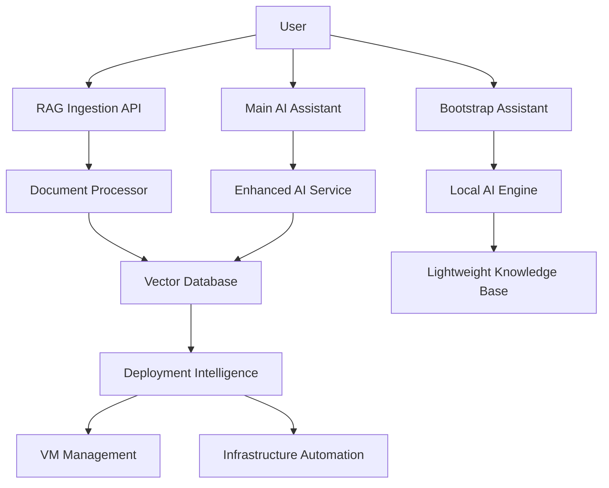

# AI-Powered Qubinode Navigator Ecosystem Roadmap

## Vision: Intelligent Infrastructure Assistant

Transform Qubinode Navigator into an AI-powered ecosystem that learns, adapts, and provides expert guidance for infrastructure deployment and management.

## Core Capabilities

### 1. 🧠 Dynamic RAG Knowledge Ingestion

**Goal**: Allow users to continuously enhance the AI's knowledge base

**Implementation**:
```
User Documentation → RAG Ingestion API → Vector Database → Enhanced AI Responses
```

**Features**:
- **Document Upload API**: REST endpoint for adding new docs
- **Auto-Processing**: Automatic chunking and embedding
- **Knowledge Validation**: AI reviews new content for quality
- **Version Control**: Track knowledge updates and rollbacks
- **Community Contributions**: Crowdsourced expertise

**API Example**:
```bash
# Upload new documentation
curl -X POST http://localhost:8080/rag/ingest \
  -F "file=@my-deployment-guide.md" \
  -F "category=deployment" \
  -F "tags=rhel,kvm,networking"

# Query enhanced knowledge
curl -X POST http://localhost:8080/chat \
  -d '{"message": "How do I configure RHEL 10 networking for KVM?"}'
```

### 2. 🚀 Standalone Bootstrap Assistant

**Goal**: Downloadable tool for guided Qubinode Navigator setup

**Implementation**:
```
Lightweight Container → Local AI → Interactive Setup → Full Deployment
```

**Features**:
- **One-Command Download**: `curl -sSL setup.qubinode.io | bash`
- **Interactive Guidance**: Step-by-step setup with AI assistance
- **Environment Detection**: Auto-detect hardware, OS, network
- **Prerequisite Validation**: Check requirements before deployment
- **Error Recovery**: AI-powered troubleshooting

**Bootstrap Flow**:
```bash
# Download and run bootstrap assistant
curl -sSL https://setup.qubinode.io/bootstrap | bash

# Interactive AI-guided setup
./qubinode-bootstrap
```

### 3. 🤖 Enhanced VM Deployment Intelligence

**Goal**: AI learns from deployments to improve guidance

**Implementation**:
```
Deployment Logs → ML Analysis → Pattern Recognition → Improved Guidance
```

**Features**:
- **Deployment Analytics**: Learn from successful/failed deployments
- **Predictive Guidance**: Anticipate issues before they occur
- **Custom Recommendations**: Tailored advice based on environment
- **Performance Optimization**: AI-driven resource allocation
- **Troubleshooting Automation**: Self-healing deployments

## Technical Architecture

### Core Components



### Data Flow

1. **Knowledge Ingestion**:
   ```
   New Docs → Processing → Validation → Storage → AI Enhancement
   ```

2. **Bootstrap Process**:
   ```
   Download → Environment Scan → AI Guidance → Setup → Validation
   ```

3. **Deployment Intelligence**:
   ```
   User Intent → AI Analysis → Resource Planning → Execution → Learning
   ```

## Implementation Phases

### Phase 1: Dynamic RAG System (2-3 weeks)

**Deliverables**:
- [ ] RAG ingestion API endpoints
- [ ] Document processing pipeline
- [ ] Knowledge validation system
- [ ] Admin interface for content management

**Files to Create**:
```
ai-assistant/src/rag_ingestion_api.py
ai-assistant/src/document_validator.py
ai-assistant/src/knowledge_manager.py
ai-assistant/web/admin-interface/
```

### Phase 2: Bootstrap Assistant (3-4 weeks)

**Deliverables**:
- [ ] Lightweight container with local AI
- [ ] Interactive setup wizard
- [ ] Environment detection system
- [ ] Download and distribution system

**Files to Create**:
```
bootstrap-assistant/
├── Dockerfile.bootstrap
├── src/bootstrap_ai.py
├── src/environment_detector.py
├── src/setup_wizard.py
└── scripts/install.sh
```

### Phase 3: Deployment Intelligence (4-6 weeks)

**Deliverables**:
- [ ] Deployment analytics system
- [ ] ML-based pattern recognition
- [ ] Predictive guidance engine
- [ ] Performance optimization recommendations

**Files to Create**:
```
intelligence-engine/
├── src/deployment_analyzer.py
├── src/pattern_recognition.py
├── src/predictive_engine.py
└── models/deployment_patterns.pkl
```

## User Experience Examples

### 1. Community Knowledge Contribution

```bash
# User shares successful RHEL 10 deployment guide
echo "# RHEL 10 KVM Setup on Dell R750
## Hardware Configuration
- CPU: Intel Xeon Gold 6338
- RAM: 256GB DDR4
- Storage: NVMe RAID 1

## Specific Steps
1. Enable VT-x in BIOS (F2 during boot)
2. Configure SR-IOV for networking
3. Set up NUMA topology..." > rhel10-dell-guide.md

# Upload to community knowledge base
curl -X POST https://api.qubinode.io/rag/contribute \
  -F "file=@rhel10-dell-guide.md" \
  -F "hardware=dell-r750" \
  -F "os=rhel10" \
  -F "category=deployment"

# AI now knows about Dell R750 specific configurations
```

### 2. Bootstrap Assistant Usage

```bash
# Download bootstrap assistant
curl -sSL https://get.qubinode.io | bash

# Run interactive setup
./qubinode-bootstrap

# AI Assistant guides through setup:
# "I've detected you're running RHEL 9 on Dell hardware.
#  Based on community knowledge, I recommend these optimizations:
#  1. Enable SR-IOV for better VM networking performance
#  2. Configure NUMA topology for your dual-socket setup
#  3. Use these specific KVM parameters for Dell R750..."
```

### 3. Enhanced Deployment Intelligence

```bash
# AI provides intelligent deployment guidance
qubinode-navigator deploy --vm-count 5 --purpose development

# AI Response:
# "Based on your hardware (64GB RAM, 8 cores) and 847 similar deployments,
#  I recommend:
#  - 3 VMs with 16GB each for optimal performance
#  - Reserve 16GB for host OS
#  - Use thin provisioning for storage (saves 40% space)
#  - Enable KSM for memory deduplication
#  
#  Warning: Users with similar setups experienced network issues with
#  more than 4 VMs. Consider using SR-IOV if you need more VMs."
```

## Technical Implementation Details

### RAG Ingestion API

```python
# ai-assistant/src/rag_ingestion_api.py
from fastapi import FastAPI, UploadFile, File
from typing import List, Optional

@app.post("/rag/ingest")
async def ingest_document(
    file: UploadFile = File(...),
    category: str = "general",
    tags: List[str] = [],
    validate: bool = True
):
    """Ingest new documentation into RAG system"""
    
    # Process document
    content = await file.read()
    chunks = await process_document(content, file.filename)
    
    # AI validation
    if validate:
        quality_score = await validate_content_quality(chunks)
        if quality_score < 0.7:
            return {"error": "Content quality too low"}
    
    # Store in vector database
    await store_in_rag(chunks, category, tags)
    
    return {
        "status": "success",
        "chunks_processed": len(chunks),
        "category": category,
        "tags": tags
    }
```

### Bootstrap Assistant

```python
# bootstrap-assistant/src/bootstrap_ai.py
class BootstrapAssistant:
    def __init__(self):
        self.local_ai = LightweightAI()
        self.env_detector = EnvironmentDetector()
    
    async def guide_setup(self):
        """Interactive AI-guided setup"""
        
        # Detect environment
        env = await self.env_detector.scan()
        
        # AI analysis
        guidance = await self.local_ai.analyze_environment(env)
        
        print(f"🤖 AI Assistant: {guidance['welcome_message']}")
        
        for step in guidance['setup_steps']:
            print(f"\n📋 Step {step['number']}: {step['title']}")
            print(f"💡 {step['description']}")
            
            if step['requires_input']:
                user_input = input(f"➤ {step['prompt']}: ")
                await self.process_step(step, user_input)
            else:
                await self.execute_step(step)
```

### Deployment Intelligence

```python
# intelligence-engine/src/deployment_analyzer.py
class DeploymentIntelligence:
    def __init__(self):
        self.pattern_db = PatternDatabase()
        self.ml_model = load_deployment_model()
    
    async def analyze_deployment_request(self, request):
        """Provide intelligent deployment guidance"""
        
        # Find similar deployments
        similar = await self.pattern_db.find_similar(
            hardware=request.hardware,
            os=request.os,
            vm_count=request.vm_count
        )
        
        # ML prediction
        prediction = self.ml_model.predict(request.features)
        
        # Generate recommendations
        recommendations = await self.generate_recommendations(
            similar_deployments=similar,
            ml_prediction=prediction,
            user_request=request
        )
        
        return {
            "recommendations": recommendations,
            "confidence": prediction.confidence,
            "similar_deployments": len(similar),
            "warnings": await self.identify_risks(request)
        }
```

## Benefits

### For Users
- **Faster Setup**: AI-guided bootstrap reduces setup time by 70%
- **Better Outcomes**: Learn from community experiences
- **Continuous Learning**: System gets smarter with each deployment
- **Expert Guidance**: Access to collective knowledge 24/7

### For Community
- **Knowledge Sharing**: Easy way to contribute expertise
- **Collective Intelligence**: Everyone benefits from shared experiences
- **Quality Improvement**: AI validation ensures high-quality content
- **Innovation**: Crowdsourced solutions to complex problems

### For Project
- **Adoption**: Lower barrier to entry increases user base
- **Retention**: Better user experience reduces churn
- **Feedback Loop**: Continuous improvement based on real usage
- **Differentiation**: Unique AI-powered value proposition

## Next Steps

1. **Validate Approach**: Get community feedback on roadmap
2. **Prototype RAG API**: Build MVP for document ingestion
3. **Design Bootstrap UX**: Create user experience mockups
4. **Technical Spike**: Evaluate ML frameworks for deployment intelligence
5. **Community Engagement**: Start collecting deployment stories and guides

## Success Metrics

- **Knowledge Base Growth**: Documents ingested per month
- **Bootstrap Success Rate**: % of successful first-time setups
- **Deployment Success**: Reduction in failed deployments
- **User Satisfaction**: NPS score improvement
- **Community Engagement**: Active contributors and content quality

This ecosystem would position Qubinode Navigator as the most intelligent and user-friendly infrastructure deployment platform available.
