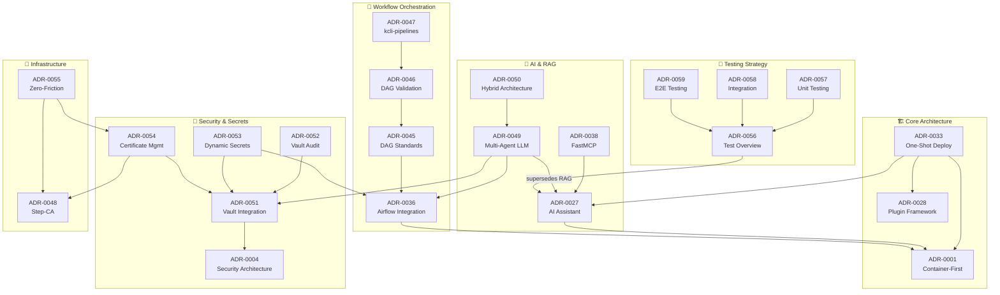
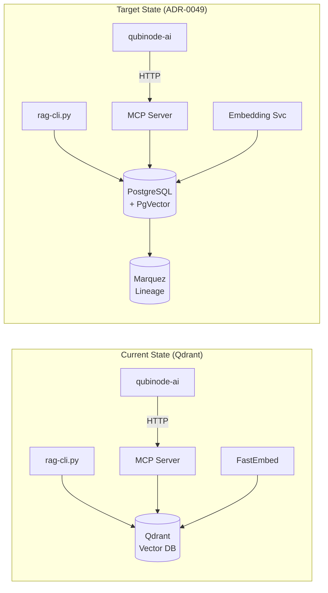

______________________________________________________________________

## layout: default title: ADR Index parent: Architectural Decision Records nav_order: 1

# Qubinode Navigator - Architecture Decision Records Index

## Overview

This document provides a comprehensive index of all Architecture Decision Records (ADRs) for the Qubinode Navigator project, organized by status and relationships.

## Current Architecture (Active ADRs)

### 🏗️ Core Architecture

- **[ADR-0001](adr-0001-container-first-execution-model-with-ansible-navigator.md)**: Container-First Execution Model with Ansible Navigator
- **[ADR-0033](adr-0033-terminal-based-one-shot-deployment-architecture.md)**: Terminal-Based One-Shot Deployment Architecture ⭐ *Primary Entry Point*
- **[ADR-0028](adr-0028-modular-plugin-framework-for-extensibility.md)**: Modular Plugin Framework for Extensibility

### 🤖 AI Assistant Integration

- **[ADR-0027](adr-0027-cpu-based-ai-deployment-assistant-architecture.md)**: CPU-Based AI Deployment Assistant Architecture ✅ *Implemented*
- **[ADR-0032](adr-0032-ai-assistant-community-distribution-strategy.md)**: AI Assistant Community Distribution Strategy
- **[ADR-0034](adr-0034-ai-assistant-terminal-integration-strategy.md)**: AI Assistant Terminal Integration Strategy
- **[ADR-0038](adr-0038-fastmcp-framework-migration.md)**: FastMCP Framework Migration for MCP Servers ✅ *Implemented*

### 🖥️ Platform Support

- **[ADR-0005](adr-0005-kvm-libvirt-virtualization-platform.md)**: KVM/Libvirt Virtualization Platform Choice
- **[ADR-0026](adr-0026-rhel-10-centos-10-platform-support-strategy.md)**: RHEL 10/CentOS 10 Platform Support Strategy

### ☁️ Multi-Cloud & Configuration

- **[ADR-0002](adr-0002-multi-cloud-inventory-strategy.md)**: Multi-Cloud Inventory Strategy
- **[ADR-0003](adr-0003-dynamic-configuration-management.md)**: Dynamic Configuration Management
- **[ADR-0009](adr-0009-cloud-provider-specific-configuration.md)**: Cloud Provider-Specific Configuration Management
- **[ADR-0023](adr-0023-enhanced-configuration-management-with-template-support-and-hashicorp-vault-integration.md)**: Enhanced Configuration Management with HashiCorp Vault

### 🔒 Security

- **[ADR-0004](adr-0004-security-architecture-ansible-vault.md)**: Security Architecture with Ansible Vault
- **[ADR-0010](adr-0010-progressive-ssh-security-model.md)**: Progressive SSH Security Model
- **[ADR-0024](adr-0024-vault-integrated-setup-script-security-enhancement.md)**: Vault-Integrated Setup Script Security Enhancement
- **[ADR-0025](adr-0025-ansible-tooling-modernization-security-strategy.md)**: Ansible Tooling Modernization and Security Strategy

### 🛠️ Development & Operations

- **[ADR-0006](adr-0006-modular-dependency-management.md)**: Modular Dependency Management Strategy
- **[ADR-0007](adr-0007-bash-first-orchestration-python-configuration.md)**: Bash-First Orchestration with Python Configuration
- **[ADR-0011](adr-0011-comprehensive-platform-validation.md)**: Comprehensive Platform Validation
- **[ADR-0030](adr-0030-software-and-os-update-strategy.md)**: Software and OS Update Strategy

### 🔄 Workflow Orchestration (Airflow)

- **[ADR-0036](adr-0036-apache-airflow-workflow-orchestration-integration.md)**: Apache Airflow Workflow Orchestration Integration
- **[ADR-0037](adr-0037-git-based-dag-repository-management.md)**: Git-Based DAG Repository Management
- **[ADR-0039](adr-0039-freeipa-vyos-airflow-dag-integration.md)**: FreeIPA and VyOS Airflow DAG Integration ⭐ *New*
- **[ADR-0040](adr-0040-dag-distribution-from-kcli-pipelines.md)**: DAG Distribution from kcli-pipelines ⭐ *New*
- **[ADR-0041](adr-0041-vyos-version-upgrade-strategy.md)**: VyOS Version Pinning and Upgrade Strategy ⭐ *New*
- **[ADR-0042](adr-0042-freeipa-base-os-upgrade-rhel9.md)**: FreeIPA Base OS Upgrade to RHEL 9 ⭐ *New*
- **[ADR-0043](adr-0043-airflow-container-host-network-access.md)**: Airflow Container Host Network Access ⭐ *New* 🔥 *Critical*
- **[ADR-0044](adr-0044-user-configurable-airflow-volume-mounts.md)**: User-Configurable Airflow Volume Mounts ⭐ *New*
- **[ADR-0045](adr-0045-airflow-dag-development-standards.md)**: Airflow DAG Development Standards ⭐ *New* 📋 *Guidelines*
- **[ADR-0046](adr-0046-dag-validation-pipeline-and-host-execution.md)**: DAG Validation Pipeline and Host-Based Execution ⭐ *New*
- **[ADR-0047](adr-0047-kcli-pipelines-dag-integration-pattern.md)**: kcli-pipelines as DAG Source Repository ⭐ *New* 🔥 *Architecture*
- **[ADR-0048](adr-0048-step-ca-integration-for-disconnected-deployments.md)**: Step-CA Integration for Disconnected Deployments ⭐ *New* 🔐 *Security*

### 📚 Documentation

- **[ADR-0029](adr-0029-documentation-strategy-and-website-modernization.md)**: Documentation Strategy and Website Modernization
- **[ADR-0035](adr-0035-terminal-centric-documentation-strategy.md)**: Terminal-Centric Documentation Strategy

### 🧠 Multi-Agent LLM & RAG Architecture

- **[ADR-0049](adr-0049-multi-agent-llm-memory-architecture.md)**: Multi-Agent LLM Memory Architecture with PgVector ✅ *Implemented*
- **[ADR-0049-implementation-plan](adr-0049-implementation-plan.md)**: ADR-0049 Implementation Plan ✅ *Complete*
- **[ADR-0050](adr-0050-hybrid-host-container-architecture.md)**: Hybrid Host-Container Architecture for Resource Optimization

### 🔐 HashiCorp Vault Integration

- **[ADR-0051](adr-0051-hashicorp-vault-secrets-management.md)**: HashiCorp Vault Integration for Secrets Management ⭐ *Security*
- **[ADR-0052](adr-0052-vault-audit-logging.md)**: Vault Audit Logging and Centralized Audit Trails
- **[ADR-0053](adr-0053-vault-dynamic-secrets-airflow.md)**: Dynamic Secrets for Apache Airflow Tasks

### 🔏 Certificate & Infrastructure Management

- **[ADR-0054](adr-0054-unified-certificate-management.md)**: Unified Certificate Management
- **[ADR-0055](adr-0055-zero-friction-infrastructure-services.md)**: Zero-Friction Infrastructure Services (DNS/Cert automation)

### 🧪 AI Assistant Testing Strategy

- **[ADR-0056](adr-0056-ai-assistant-test-strategy-overview.md)**: AI Assistant Test Strategy Overview ⭐ *New*
- **[ADR-0057](adr-0057-ai-assistant-unit-testing-standards.md)**: AI Assistant Unit Testing Standards ⭐ *New*
- **[ADR-0058](adr-0058-ai-assistant-integration-testing-approach.md)**: AI Assistant Integration Testing Approach ⭐ *New*
- **[ADR-0059](adr-0059-ai-assistant-e2e-testing-strategy.md)**: AI Assistant End-to-End Testing Strategy ⭐ *New*
- **[ADR-0060](adr-0060-ai-assistant-test-strategy-diagrams.md)**: AI Assistant Test Strategy Diagrams ⭐ *New*

## Deprecated ADRs

### ❌ Fully Superseded

| ADR                                                            | Title                         | Superseded By | Reason                                                   |
| -------------------------------------------------------------- | ----------------------------- | ------------- | -------------------------------------------------------- |
| [ADR-0008](adr-0008-os-specific-deployment-script-strategy.md) | OS-Specific Deployment Script | ADR-0033      | Unified deployment approach replaces OS-specific scripts |
| [ADR-0031](adr-0031-setup-script-modernization-strategy.md)    | Setup Script Modernization    | ADR-0033      | Goals achieved through one-shot deployment architecture  |

### ⚠️ Partially Superseded

| ADR                                                                    | Title                  | Active Components                                             | Superseded Components                                   |
| ---------------------------------------------------------------------- | ---------------------- | ------------------------------------------------------------- | ------------------------------------------------------- |
| [ADR-0027](adr-0027-cpu-based-ai-deployment-assistant-architecture.md) | CPU-Based AI Assistant | llama.cpp, Granite model, CLI interface, container deployment | RAG storage (ChromaDB → Qdrant → PgVector per ADR-0049) |

**Note:** ADR-0027 core architecture remains active. Only the vector database component is superseded:

- *Original plan: ChromaDB*
- *Current implementation: Qdrant (interim)*
- *Target: PgVector (ADR-0049)*

## Architecture Relationships

### Complete ADR Dependency Graph



### RAG Data Flow Architecture



### Primary Deployment Flow

```
ADR-0033 (One-Shot Deployment) ⭐ Primary Entry Point
├── depends on → ADR-0001 (Container-First Execution)
├── depends on → ADR-0027 (AI Assistant Architecture)
├── depends on → ADR-0026 (RHEL 10/CentOS 10 Support)
├── integrates → ADR-0002 (Multi-Cloud Inventory)
├── integrates → ADR-0004 (Security/Vault)
└── supersedes → ADR-0008, ADR-0031
```

### AI Assistant & RAG Evolution

```
ADR-0027 (AI Assistant)
├── implemented → llama.cpp + Granite model
├── implemented → Qdrant RAG (interim)
├── partially superseded by → ADR-0049 (PgVector migration)
├── enhanced by → ADR-0038 (FastMCP)
└── enhanced by → ADR-0050 (Hybrid Architecture)

ADR-0049 (Multi-Agent LLM)
├── supersedes → ADR-0027 RAG component
├── depends on → ADR-0036 (Airflow PostgreSQL)
├── introduces → PgVector, OpenLineage/Marquez
├── introduces → Manager + Developer agents
└── implementation → In Progress (see adr-0049-implementation-plan.md)
```

### Security Architecture Chain

```
ADR-0004 (Security Architecture) - Foundation
├── enhanced by → ADR-0024 (Vault Integration)
├── modernized by → ADR-0025 (Ansible Security)
├── supports → ADR-0010 (SSH Security)
└── evolved to → ADR-0051 (HashiCorp Vault)

ADR-0051 (HashiCorp Vault) - Enterprise Secrets
├── audit → ADR-0052 (Vault Audit Logging)
├── dynamic secrets → ADR-0053 (Airflow Integration)
└── PKI → ADR-0054 (Certificate Management)

ADR-0054 (Certificate Management) + ADR-0048 (Step-CA)
└── enables → ADR-0055 (Zero-Friction Infrastructure)
```

### Airflow DAG Hierarchy

```
ADR-0036 (Airflow Integration) - Foundation
├── standards → ADR-0045 (DAG Development Standards)
├── validation → ADR-0046 (DAG Validation Pipeline)
├── execution → ADR-0043 (Host Network Access)
├── distribution → ADR-0040 (DAG Distribution)
└── source → ADR-0047 (kcli-pipelines Integration)
```

## Implementation Status Summary

### ✅ Implemented (Production Ready)

- Core deployment architecture (ADR-0033)
- AI Assistant core (ADR-0027) - llama.cpp + Granite model, Qdrant RAG
- RHEL 10/CentOS 10 support (ADR-0026)
- Plugin framework (ADR-0028)
- Security modernization (ADR-0025)
- **FastMCP server (ADR-0038)** - 24 tools in production
- **Multi-Agent LLM Architecture (ADR-0049)** - PgVector, Manager/Developer agents, OpenLineage
- **Hybrid Host-Container Architecture (ADR-0050)** - Resource optimization
- DAG Development Standards (ADR-0045) and Validation Pipeline (ADR-0046)
- AI Assistant Testing Strategy (ADR-0056-0060) - 84% test coverage

### 🚧 In Progress

- Airflow host network access (ADR-0043) 🔥 *Critical blocker for VM connectivity*
- FreeIPA and VyOS DAG integration (ADR-0039, ADR-0040)
- VyOS version upgrade (ADR-0041)
- FreeIPA RHEL 9 migration (ADR-0042)
- Documentation strategy implementation (ADR-0029, ADR-0035)

### 📋 Planned

- HashiCorp Vault integration (ADR-0051, ADR-0052, ADR-0053)
- Unified certificate management (ADR-0054)
- Zero-friction infrastructure (ADR-0055)
- Software update automation (ADR-0030)

## Quick Navigation

### For New Users

1. Start with **ADR-0033** (Terminal-Based One-Shot Deployment) - the main deployment approach
1. Review **ADR-0034** (AI Assistant Integration) - for understanding AI-powered assistance
1. Check **ADR-0026** (RHEL 10/CentOS 10 Support) - for modern OS compatibility

### For Developers

1. **ADR-0028** (Plugin Framework) - for extending functionality
1. **ADR-0001** (Container-First Execution) - for understanding execution model
1. **ADR-0007** (Bash-First Orchestration) - for scripting patterns

### For AI/RAG Development

1. **ADR-0049** (Multi-Agent LLM Memory) - target architecture for RAG/vector storage
1. **ADR-0027** (AI Assistant) - current implementation (Qdrant interim)
1. **ADR-0038** (FastMCP) - MCP server framework
1. **ADR-0050** (Hybrid Architecture) - host vs container component placement

### For Airflow DAG Development

1. **ADR-0045** (DAG Development Standards) 📋 - **MUST READ** for DAG authors
1. **ADR-0036** (Airflow Integration) - foundational Airflow architecture
1. **ADR-0046** (DAG Validation Pipeline) - CI/CD for DAGs
1. **ADR-0047** (kcli-pipelines Integration) - DAG source repository

### For Security/Operations

1. **ADR-0004** (Security Architecture) - foundational security model
1. **ADR-0051** (HashiCorp Vault) - enterprise secrets management
1. **ADR-0054** (Certificate Management) - unified PKI
1. **ADR-0055** (Zero-Friction Infrastructure) - automated DNS/certs

## Reserved & Available ADR Numbers

### Reserved (Gap in sequence)

- ADR-0012 through ADR-0022 - Available for future decisions

### Next Available

- ADR-0061 and onwards

## Consistency Notes

### Vector Database Evolution

| Version | ADR      | Technology            | Status                |
| ------- | -------- | --------------------- | --------------------- |
| v1      | ADR-0027 | ChromaDB (documented) | Never implemented     |
| v2      | ADR-0027 | Qdrant (actual)       | **Current - Interim** |
| v3      | ADR-0049 | PgVector              | **Target - Planned**  |

### Tool Relationships

| Tool                    | Purpose                | Related ADRs       |
| ----------------------- | ---------------------- | ------------------ |
| `rag-cli.py`            | Direct RAG operations  | ADR-0027, ADR-0049 |
| `qubinode-ai`           | AI chat interface      | ADR-0027, ADR-0034 |
| `mcp_server_fastmcp.py` | MCP tool exposure      | ADR-0038           |
| `qubinode-cert`         | Certificate management | ADR-0054           |
| `qubinode-dns`          | DNS management         | ADR-0055           |

______________________________________________________________________

*Last Updated: 2025-12-05*
*This index is maintained manually. Please update when adding new ADRs.*
