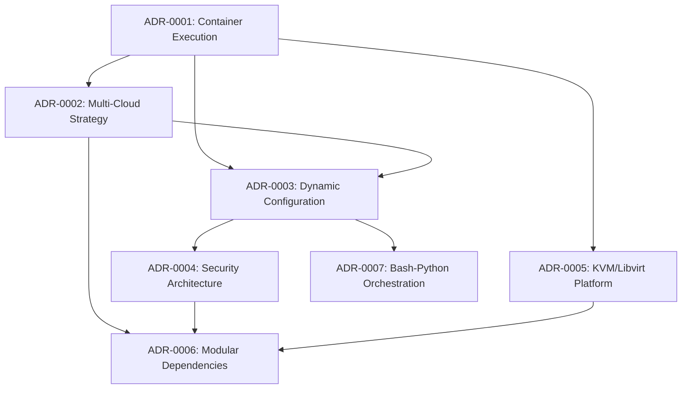

# Architectural Decision Records (ADRs)

This directory contains the Architectural Decision Records for the Qubinode Navigator project. ADRs document the key architectural decisions made during the development and evolution of the system.

## ADR Index

| ADR | Title | Status | Date | Impact |
|-----|-------|--------|------|--------|
| [ADR-0001](adr-0001-container-first-execution-model-with-ansible-navigator.md) | Container-First Execution Model with Ansible Navigator | Accepted | 2025-01-09 | High |
| [ADR-0002](adr-0002-multi-cloud-inventory-strategy.md) | Multi-Cloud Inventory Strategy with Environment-Specific Configurations | Accepted | 2025-01-09 | High |
| [ADR-0003](adr-0003-dynamic-configuration-management.md) | Dynamic Configuration Management with Python | Accepted | 2025-01-09 | High |
| [ADR-0004](adr-0004-security-architecture-ansible-vault.md) | Security Architecture with Ansible Vault and AnsibleSafe | Accepted | 2025-01-09 | Critical |
| [ADR-0005](adr-0005-kvm-libvirt-virtualization-platform.md) | KVM/Libvirt Virtualization Platform Choice | Accepted | 2025-01-09 | High |
| [ADR-0006](adr-0006-modular-dependency-management.md) | Modular Dependency Management Strategy | Accepted | 2025-01-09 | Medium |
| [ADR-0007](adr-0007-bash-first-orchestration-python-configuration.md) | Bash-First Orchestration with Python Configuration | Accepted | 2025-01-09 | Medium |
| [ADR-0008](adr-0008-os-specific-deployment-script-strategy.md) | OS-Specific Deployment Script Strategy | Accepted | 2025-01-09 | High |
| [ADR-0009](adr-0009-cloud-provider-specific-configuration.md) | Cloud Provider-Specific Configuration Management | Accepted | 2025-01-09 | High |
| [ADR-0010](adr-0010-progressive-ssh-security-model.md) | Progressive SSH Security Model | Accepted | 2025-01-09 | Critical |
| [ADR-0011](adr-0011-comprehensive-platform-validation.md) | Comprehensive Platform Validation Through Research Analysis | Accepted | 2025-01-09 | High |

## ADRs by Category

### Infrastructure & Deployment
- **ADR-0001**: Container-First Execution Model with Ansible Navigator
- **ADR-0002**: Multi-Cloud Inventory Strategy with Environment-Specific Configurations
- **ADR-0005**: KVM/Libvirt Virtualization Platform Choice
- **ADR-0008**: OS-Specific Deployment Script Strategy
- **ADR-0009**: Cloud Provider-Specific Configuration Management

### Configuration & Automation
- **ADR-0003**: Dynamic Configuration Management with Python
- **ADR-0007**: Bash-First Orchestration with Python Configuration

### Security & Operations
- **ADR-0004**: Security Architecture with Ansible Vault and AnsibleSafe
- **ADR-0010**: Progressive SSH Security Model

### Architecture & Design
- **ADR-0006**: Modular Dependency Management Strategy

### Validation & Research
- **ADR-0011**: Comprehensive Platform Validation Through Research Analysis

## ADRs by Impact Level

### Critical Impact
- **ADR-0004**: Security Architecture with Ansible Vault and AnsibleSafe
- **ADR-0010**: Progressive SSH Security Model

### High Impact
- **ADR-0001**: Container-First Execution Model with Ansible Navigator
- **ADR-0002**: Multi-Cloud Inventory Strategy with Environment-Specific Configurations
- **ADR-0003**: Dynamic Configuration Management with Python
- **ADR-0005**: KVM/Libvirt Virtualization Platform Choice
- **ADR-0008**: OS-Specific Deployment Script Strategy
- **ADR-0009**: Cloud Provider-Specific Configuration Management
- **ADR-0011**: Comprehensive Platform Validation Through Research Analysis

### Medium Impact
- **ADR-0006**: Modular Dependency Management Strategy
- **ADR-0007**: Bash-First Orchestration with Python Configuration

## Key Architectural Themes

### 🏗️ **Infrastructure Automation**
The project adopts a comprehensive infrastructure automation approach using:
- **Containerized Execution**: Ansible Navigator with standardized execution environments
- **Multi-Cloud Support**: Environment-specific inventory management
- **Virtualization**: KVM/libvirt for VM management and orchestration

### 🔧 **Configuration Management**
Dynamic and flexible configuration management through:
- **Automated Discovery**: Python-based system and network discovery
- **Environment Adaptation**: Automatic configuration for different deployment targets
- **Structured Data**: YAML-based configuration with validation

### 🔒 **Security Architecture**
Security-first design with:
- **Credential Protection**: Ansible Vault with AnsibleSafe enhancement
- **Environment Isolation**: Separate security contexts per environment
- **Access Control**: Role-based access and audit trails

### 🎯 **Modular Design**
Extensible and maintainable architecture featuring:
- **Service Integration**: Modular dependency management for external services
- **Language Specialization**: Bash for orchestration, Python for configuration
- **Loose Coupling**: Independent modules with clear interfaces

## Decision Relationships

## Implementation Status

### ✅ Fully Implemented
- Container-first execution with Ansible Navigator
- Multi-cloud inventory strategy
- Dynamic configuration management
- Security architecture with Vault
- KVM/libvirt virtualization
- Modular dependency management
- Bash-Python orchestration

### 🔄 Ongoing Evolution
- Additional cloud provider integrations
- Enhanced security features
- Performance optimizations
- Monitoring and observability

## Future ADR Candidates

### Potential High-Priority ADRs
- **Testing Strategy**: Automated testing approach and frameworks
- **Monitoring & Observability**: System monitoring and alerting strategy
- **Disaster Recovery**: Backup and recovery procedures
- **Performance Optimization**: System performance tuning decisions

### Potential Medium-Priority ADRs
- **Documentation Strategy**: Documentation tooling and maintenance approach
- **CI/CD Pipeline**: Continuous integration and deployment strategy
- **Compliance Framework**: Regulatory compliance and audit procedures
- **User Interface**: Management interface and user experience decisions

## ADR Process

### Creating New ADRs
1. **Identify Decision**: Recognize a significant architectural decision
2. **Research Alternatives**: Evaluate different approaches and trade-offs
3. **Document Decision**: Use the established ADR template format
4. **Review Process**: Stakeholder review and approval
5. **Implementation**: Execute the architectural decision
6. **Update Index**: Add to this index and update relationships

### ADR Template
New ADRs should follow the established template structure:
- **Status**: Proposed, Accepted, Deprecated, Superseded
- **Context**: Problem statement and constraints
- **Decision**: The architectural choice made
- **Consequences**: Positive and negative impacts
- **Alternatives**: Options considered and rejected
- **Evidence**: Supporting information and rationale

### Review and Maintenance
- **Regular Reviews**: Quarterly ADR review sessions
- **Status Updates**: Update ADR status as decisions evolve
- **Relationship Mapping**: Maintain decision dependency relationships
- **Archive Management**: Properly archive superseded decisions

## Contributing

When contributing to the architectural decisions:
1. **Follow Template**: Use the established ADR format
2. **Provide Evidence**: Include concrete evidence from codebase analysis
3. **Consider Alternatives**: Document alternative approaches considered
4. **Impact Assessment**: Clearly articulate consequences and trade-offs
5. **Stakeholder Input**: Engage relevant stakeholders in the decision process

## Contact

For questions about architectural decisions or the ADR process:
- **Project Maintainers**: Primary contacts for architectural guidance
- **DevOps Team**: Infrastructure and deployment decisions
- **Security Team**: Security-related architectural choices
- **Development Teams**: Implementation and technical decisions
