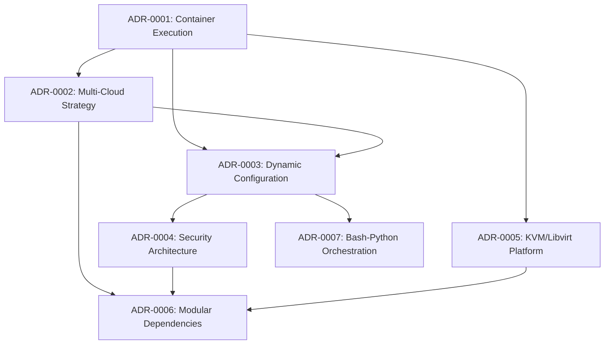

______________________________________________________________________

## layout: default title: Architectural Decision Records nav_order: 3 has_children: true permalink: /adrs/

# Architecture Decision Records (ADRs)

This directory contains the Architecture Decision Records for the Qubinode Navigator project.

## Quick Navigation

📋 **[ADR Index](ADR-INDEX.md)** - Comprehensive overview of all ADRs with relationships and navigation guide

## Current Architecture Overview

The Qubinode Navigator follows a **terminal-based one-shot deployment architecture** with integrated AI assistance:

- **Primary Entry Point**: [ADR-0033](adr-0033-terminal-based-one-shot-deployment-architecture.md) - Terminal-Based One-Shot Deployment
- **AI Integration**: [ADR-0034](adr-0034-ai-assistant-terminal-integration-strategy.md) - AI Assistant Terminal Integration
- **Documentation**: [ADR-0035](adr-0035-terminal-centric-documentation-strategy.md) - Terminal-Centric Documentation

ADRs document the key architectural decisions made during the development and evolution of the system.

## ADR Index

**See [ADR-INDEX.md](ADR-INDEX.md) for the complete index with relationships and Mermaid diagrams.**

| ADR                                                                                                             | Title                            | Status          | Impact    |
| --------------------------------------------------------------------------------------------------------------- | -------------------------------- | --------------- | --------- |
| [ADR-0001](adr-0001-container-first-execution-model-with-ansible-navigator.md)                                  | Container-First Execution Model  | Accepted        | High      |
| [ADR-0002](adr-0002-multi-cloud-inventory-strategy.md)                                                          | Multi-Cloud Inventory Strategy   | Accepted        | High      |
| [ADR-0003](adr-0003-dynamic-configuration-management.md)                                                        | Dynamic Configuration Management | Accepted        | High      |
| [ADR-0004](adr-0004-security-architecture-ansible-vault.md)                                                     | Security Architecture            | Accepted        | Critical  |
| [ADR-0005](adr-0005-kvm-libvirt-virtualization-platform.md)                                                     | KVM/Libvirt Platform             | Accepted        | High      |
| [ADR-0006](adr-0006-modular-dependency-management.md)                                                           | Modular Dependency Management    | Accepted        | Medium    |
| [ADR-0007](adr-0007-bash-first-orchestration-python-configuration.md)                                           | Bash-First Orchestration         | Accepted        | Medium    |
| [ADR-0008](adr-0008-os-specific-deployment-script-strategy.md)                                                  | OS-Specific Deployment           | **Deprecated**  | -         |
| [ADR-0009](adr-0009-cloud-provider-specific-configuration.md)                                                   | Cloud Provider Configuration     | Accepted        | High      |
| [ADR-0010](adr-0010-progressive-ssh-security-model.md)                                                          | Progressive SSH Security         | Accepted        | Critical  |
| [ADR-0011](adr-0011-comprehensive-platform-validation.md)                                                       | Platform Validation              | Accepted        | High      |
| ADR-0012 to ADR-0022                                                                                            | *Reserved*                       | -               | -         |
| [ADR-0023](adr-0023-enhanced-configuration-management-with-template-support-and-hashicorp-vault-integration.md) | Enhanced Configuration + Vault   | Accepted        | High      |
| [ADR-0024](adr-0024-vault-integrated-setup-script-security-enhancement.md)                                      | Vault-Integrated Setup           | Accepted        | Critical  |
| [ADR-0025](adr-0025-ansible-tooling-modernization-security-strategy.md)                                         | Ansible Security Modernization   | Accepted        | Critical  |
| [ADR-0026](adr-0026-rhel-10-centos-10-platform-support-strategy.md)                                             | RHEL 10/CentOS 10 Support        | Accepted        | High      |
| [ADR-0027](adr-0027-cpu-based-ai-deployment-assistant-architecture.md)                                          | AI Deployment Assistant          | Accepted        | High      |
| [ADR-0028](adr-0028-modular-plugin-framework-for-extensibility.md)                                              | Plugin Framework                 | Accepted        | High      |
| [ADR-0029](adr-0029-documentation-strategy-and-website-modernization.md)                                        | Documentation Strategy           | Proposed        | High      |
| [ADR-0030](adr-0030-software-and-os-update-strategy.md)                                                         | Software Update Strategy         | Proposed        | High      |
| [ADR-0031](adr-0031-setup-script-modernization-strategy.md)                                                     | Setup Script Modernization       | **Deprecated**  | -         |
| [ADR-0032](adr-0032-ai-assistant-community-distribution-strategy.md)                                            | AI Assistant Distribution        | Accepted        | High      |
| [ADR-0033](adr-0033-terminal-based-one-shot-deployment-architecture.md)                                         | **One-Shot Deployment**          | Accepted        | High      |
| [ADR-0034](adr-0034-ai-assistant-terminal-integration-strategy.md)                                              | AI Terminal Integration          | Accepted        | High      |
| [ADR-0035](adr-0035-terminal-centric-documentation-strategy.md)                                                 | Terminal Documentation           | Proposed        | Medium    |
| [ADR-0036](adr-0036-apache-airflow-workflow-orchestration-integration.md)                                       | Airflow Integration              | Accepted        | High      |
| [ADR-0037](adr-0037-git-based-dag-repository-management.md)                                                     | Git-Based DAG Management         | Accepted        | Medium    |
| [ADR-0038](adr-0038-fastmcp-framework-migration.md)                                                             | FastMCP Migration                | **Implemented** | High      |
| [ADR-0039](adr-0039-freeipa-vyos-airflow-dag-integration.md)                                                    | FreeIPA/VyOS DAGs                | Proposed        | High      |
| [ADR-0040](adr-0040-dag-distribution-from-kcli-pipelines.md)                                                    | DAG Distribution                 | Proposed        | Medium    |
| [ADR-0041](adr-0041-vyos-version-upgrade-strategy.md)                                                           | VyOS Version Strategy            | Proposed        | Medium    |
| [ADR-0042](adr-0042-freeipa-base-os-upgrade-rhel9.md)                                                           | FreeIPA RHEL 9 Upgrade           | Proposed        | High      |
| [ADR-0043](adr-0043-airflow-container-host-network-access.md)                                                   | Airflow Host Network             | Accepted        | Critical  |
| [ADR-0044](adr-0044-user-configurable-airflow-volume-mounts.md)                                                 | Airflow Volume Mounts            | Accepted        | Medium    |
| [ADR-0045](adr-0045-airflow-dag-development-standards.md)                                                       | **DAG Development Standards**    | Accepted        | Critical  |
| [ADR-0046](adr-0046-dag-validation-pipeline-and-host-execution.md)                                              | DAG Validation Pipeline          | Accepted        | High      |
| [ADR-0047](adr-0047-kcli-pipelines-dag-integration-pattern.md)                                                  | kcli-pipelines Integration       | Accepted        | High      |
| [ADR-0048](adr-0048-step-ca-integration-for-disconnected-deployments.md)                                        | Step-CA Integration              | Accepted        | High      |
| [ADR-0049](adr-0049-multi-agent-llm-memory-architecture.md)                                                     | **Multi-Agent LLM Architecture** | **Implemented** | Strategic |
| [ADR-0050](adr-0050-hybrid-host-container-architecture.md)                                                      | Hybrid Host-Container            | **Implemented** | High      |
| [ADR-0051](adr-0051-hashicorp-vault-secrets-management.md)                                                      | HashiCorp Vault Secrets          | Accepted        | Critical  |
| [ADR-0052](adr-0052-vault-audit-logging.md)                                                                     | Vault Audit Logging              | Accepted        | High      |
| [ADR-0053](adr-0053-vault-dynamic-secrets-airflow.md)                                                           | Dynamic Secrets for Airflow      | Accepted        | High      |
| [ADR-0054](adr-0054-unified-certificate-management.md)                                                          | Unified Certificate Mgmt         | Accepted        | High      |
| [ADR-0055](adr-0055-zero-friction-infrastructure-services.md)                                                   | Zero-Friction Infrastructure     | Accepted        | High      |

## ADRs by Category

For detailed categorization with relationships, see **[ADR-INDEX.md](ADR-INDEX.md)**.

### Core Architecture

- ADR-0001, ADR-0033, ADR-0028

### AI & RAG

- ADR-0027, ADR-0038, ADR-0049, ADR-0050

### Workflow Orchestration (Airflow)

- ADR-0036, ADR-0043, ADR-0045, ADR-0046, ADR-0047

### Security & Secrets

- ADR-0004, ADR-0051, ADR-0052, ADR-0053, ADR-0054

### Infrastructure Services

- ADR-0048, ADR-0055

### AI Assistant Testing

- ADR-0056, ADR-0057, ADR-0058, ADR-0059, ADR-0060

### Deprecated

- ADR-0008 (fully superseded by ADR-0033)
- ADR-0031 (fully superseded by ADR-0033)
- ADR-0027 RAG component only (partially superseded by ADR-0049 - core architecture remains active)

## Key Architectural Themes

### 🏗️ **Infrastructure Automation**

The project adopts a comprehensive infrastructure automation approach using:

- **Containerized Execution**: Ansible Navigator with standardized execution environments
- **Multi-Cloud Support**: Environment-specific inventory management
- **Virtualization**: KVM/libvirt for VM management and orchestration

### 🔧 **Configuration Management**

Dynamic and flexible configuration management through:

- **Automated Discovery**: Python-based system and network discovery
- **Environment Adaptation**: Automatic configuration for different deployment targets
- **Structured Data**: YAML-based configuration with validation

### 🔒 **Security Architecture**

Security-first design with:

- **Credential Protection**: Ansible Vault with AnsibleSafe enhancement
- **Environment Isolation**: Separate security contexts per environment
- **Access Control**: Role-based access and audit trails

### 🎯 **Modular Design**

Extensible and maintainable architecture featuring:

- **Service Integration**: Modular dependency management for external services
- **Language Specialization**: Bash for orchestration, Python for configuration
- **Loose Coupling**: Independent modules with clear interfaces

## Decision Relationships

## Implementation Status

### ✅ Fully Implemented

- Container-first execution with Ansible Navigator
- Multi-cloud inventory strategy
- Dynamic configuration management
- Security architecture with Vault
- KVM/libvirt virtualization
- Modular dependency management
- Bash-Python orchestration

### 🔄 Ongoing Evolution

- Additional cloud provider integrations
- Enhanced security features
- Performance optimizations
- Monitoring and observability

## Future ADR Candidates

### High-Priority (Recommended)

- **Monitoring & Observability**: System monitoring and alerting strategy for AI Assistant and Airflow
- **Disaster Recovery**: Backup and recovery procedures for RAG data and configurations
- **Performance Optimization**: System performance tuning decisions for llama.cpp and embedding

### Medium-Priority (Planned)

- **CI/CD Pipeline Enhancement**: Expand ADR-0046 DAG validation to full CI/CD
- **Compliance Framework**: Regulatory compliance and audit procedures
- **User Interface**: Management dashboard for AI Assistant and workflow monitoring

### Already Implemented

The following previously proposed ADRs have been implemented:

| Topic                  | Implemented In               |
| ---------------------- | ---------------------------- |
| Testing Strategy       | ADR-0056 through ADR-0060    |
| Documentation Strategy | ADR-0029, ADR-0035           |
| Secrets Management     | ADR-0051, ADR-0052, ADR-0053 |
| Certificate Management | ADR-0054                     |

## ADR Process

### Creating New ADRs

1. **Identify Decision**: Recognize a significant architectural decision
1. **Research Alternatives**: Evaluate different approaches and trade-offs
1. **Document Decision**: Use the established ADR template format
1. **Review Process**: Stakeholder review and approval
1. **Implementation**: Execute the architectural decision
1. **Update Index**: Add to this index and update relationships

### ADR Template

New ADRs should follow the established template structure:

- **Status**: Proposed, Accepted, Deprecated, Superseded
- **Context**: Problem statement and constraints
- **Decision**: The architectural choice made
- **Consequences**: Positive and negative impacts
- **Alternatives**: Options considered and rejected
- **Evidence**: Supporting information and rationale

### Review and Maintenance

- **Regular Reviews**: Quarterly ADR review sessions
- **Status Updates**: Update ADR status as decisions evolve
- **Relationship Mapping**: Maintain decision dependency relationships
- **Archive Management**: Properly archive superseded decisions

## Contributing

When contributing to the architectural decisions:

1. **Follow Template**: Use the established ADR format
1. **Provide Evidence**: Include concrete evidence from codebase analysis
1. **Consider Alternatives**: Document alternative approaches considered
1. **Impact Assessment**: Clearly articulate consequences and trade-offs
1. **Stakeholder Input**: Engage relevant stakeholders in the decision process

## Contact

For questions about architectural decisions or the ADR process:

- **Project Maintainers**: Primary contacts for architectural guidance
- **DevOps Team**: Infrastructure and deployment decisions
- **Security Team**: Security-related architectural choices
- **Development Teams**: Implementation and technical decisions
