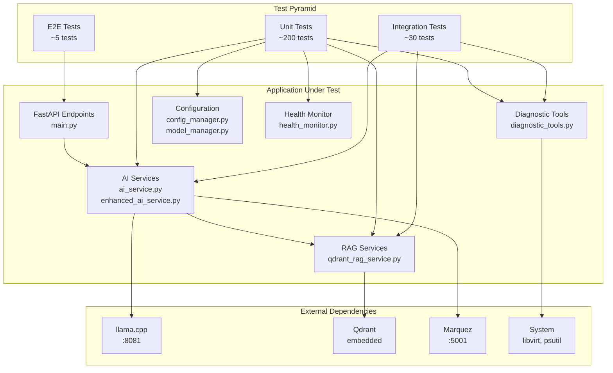

# ADR-0060: AI Assistant Test Strategy Diagrams

## Status

PROPOSED

## Date

2025-12-05

## Context

This ADR provides visual documentation for the AI Assistant test strategy defined in ADRs 0056-0059. Visual diagrams help team members quickly understand the testing approach.

## Decision

The following diagrams document our test strategy.

______________________________________________________________________

## 1. Custom Test Pyramid for AI Assistant

```
                            ╔═══════════════════════╗
                           ╱                         ╲
                          ╱    E2E Tests (3%)         ╲
                         ╱     ~5 tests                ╲
                        ╱      • Chat workflow          ╲
                       ╱       • Health pipeline         ╲
                      ╱        • Diagnostic workflow      ╲
                     ╔═══════════════════════════════════╗
                    ╱                                     ╲
                   ╱     Integration Tests (12%)           ╲
                  ╱      ~30 tests                          ╲
                 ╱       • llama.cpp HTTP (~8 tests)         ╲
                ╱        • Qdrant RAG ops (~10 tests)         ╲
               ╱         • Marquez contract (~5 tests)         ╲
              ╱          • FastAPI endpoints (~7 tests)         ╲
             ╔═══════════════════════════════════════════════════╗
            ╱                                                     ╲
           ╱            Unit Tests (85%)                           ╲
          ╱             ~200 tests                                  ╲
         ╱              • ConfigManager (33 tests)                   ╲
        ╱               • DiagnosticTools (26 tests)                  ╲
       ╱                • HealthMonitor (18 tests)                     ╲
      ╱                 • AIService (28 tests)                          ╲
     ╱                  • EnhancedAIService (31 tests)                   ╲
    ╱                   • ModelManager (19 tests) [NEEDS EXPANSION]       ╲
   ╱                    • RAGServices (35 tests)                           ╲
  ╱                     • Main FastAPI (27 tests)                           ╲
 ╚═══════════════════════════════════════════════════════════════════════════╝

 Target Coverage: 80% minimum | 85% target
 Current: 76.20% (228 tests, 31 skipped)
```

______________________________________________________________________

## 2. Test Architecture Diagram



### Text Version:

```
┌─────────────────────────────────────────────────────────────────────────────┐
│                              TEST LAYERS                                     │
├─────────────────────────────────────────────────────────────────────────────┤
│                                                                             │
│  ┌─────────────────────────────────────────────────────────────────────┐   │
│  │                      E2E TESTS (~5 tests)                            │   │
│  │  test_chat_workflow.py        test_health_pipeline.py                │   │
│  │  test_diagnostic_workflow.py                                         │   │
│  └──────────────────────────────────┬──────────────────────────────────┘   │
│                                     │                                       │
│                                     ▼                                       │
│  ┌─────────────────────────────────────────────────────────────────────┐   │
│  │                 INTEGRATION TESTS (~30 tests)                        │   │
│  │  test_llm_integration.py     test_rag_workflow.py                    │   │
│  │  test_marquez_contract.py    test_api_endpoints.py                   │   │
│  └──────────────────────────────────┬──────────────────────────────────┘   │
│                                     │                                       │
│                                     ▼                                       │
│  ┌─────────────────────────────────────────────────────────────────────┐   │
│  │                    UNIT TESTS (~200 tests)                           │   │
│  │                                                                       │   │
│  │  ┌─────────────┐ ┌─────────────┐ ┌─────────────┐ ┌─────────────┐    │   │
│  │  │   config    │ │   model     │ │     ai      │ │   enhanced  │    │   │
│  │  │  manager    │ │   manager   │ │   service   │ │  ai service │    │   │
│  │  │   91.7%     │ │   57.7%*    │ │    ~75%     │ │    ~75%     │    │   │
│  │  └─────────────┘ └─────────────┘ └─────────────┘ └─────────────┘    │   │
│  │                                                                       │   │
│  │  ┌─────────────┐ ┌─────────────┐ ┌─────────────┐ ┌─────────────┐    │   │
│  │  │ diagnostic  │ │   health    │ │     rag     │ │    main     │    │   │
│  │  │   tools     │ │   monitor   │ │  services   │ │  (FastAPI)  │    │   │
│  │  │   79.4%     │ │   84.0%     │ │    ~80%     │ │   75.9%     │    │   │
│  │  └─────────────┘ └─────────────┘ └─────────────┘ └─────────────┘    │   │
│  │                                                                       │   │
│  │  * Priority: HIGH - needs improvement                                 │   │
│  └─────────────────────────────────────────────────────────────────────┘   │
│                                                                             │
└─────────────────────────────────────────────────────────────────────────────┘
```

______________________________________________________________________

## 3. Integration Points Map

```
┌─────────────────────────────────────────────────────────────────────────────┐
│                        INTEGRATION POINTS                                    │
├─────────────────────────────────────────────────────────────────────────────┤
│                                                                             │
│   AI Assistant                                                              │
│   Application                    External Services                          │
│                                                                             │
│   ┌──────────────┐              ┌──────────────┐                           │
│   │              │   HTTP POST  │              │                           │
│   │  AIService   │─────────────▶│  llama.cpp   │   Test Strategy:          │
│   │              │   /completion│   :8081      │   • Mock httpx.post       │
│   │              │◀─────────────│              │   • Verify request format │
│   └──────────────┘   JSON       └──────────────┘   • Test timeout handling │
│                      response                                               │
│                                                                             │
│   ┌──────────────┐              ┌──────────────┐                           │
│   │              │   fastembed  │              │                           │
│   │  RAGService  │─────────────▶│   Qdrant     │   Test Strategy:          │
│   │              │   collection │  (embedded)  │   • In-memory test DB     │
│   │              │◀─────────────│              │   • Isolated collections  │
│   └──────────────┘   results    └──────────────┘   • Real search tests     │
│                                                                             │
│   ┌──────────────┐              ┌──────────────┐                           │
│   │              │   REST API   │              │                           │
│   │ MarquezSvc   │─────────────▶│   Marquez    │   Test Strategy:          │
│   │              │   /api/v1/*  │    :5001     │   • Mock API responses    │
│   │              │◀─────────────│              │   • Contract validation   │
│   └──────────────┘   JSON       └──────────────┘   • Unavailable fallback  │
│                                                                             │
│   ┌──────────────┐              ┌──────────────┐                           │
│   │              │  subprocess  │              │                           │
│   │ Diagnostics  │─────────────▶│   System     │   Test Strategy:          │
│   │              │  psutil      │  libvirt     │   • Mock subprocess.run   │
│   │              │◀─────────────│  /proc       │   • Skip in CI            │
│   └──────────────┘  return code └──────────────┘   • Real tests local      │
│                                                                             │
│   ┌──────────────┐              ┌──────────────┐                           │
│   │              │   REST API   │              │                           │
│   │  LiteLLM     │─────────────▶│  OpenAI/     │   Test Strategy:          │
│   │   Client     │              │  Anthropic   │   • Mock litellm module   │
│   │              │◀─────────────│              │   • Verify API key usage  │
│   └──────────────┘              └──────────────┘   • Test rate limits      │
│                                                                             │
└─────────────────────────────────────────────────────────────────────────────┘
```

______________________________________________________________________

## 4. Test Flow in CI/CD Pipeline

```
┌─────────────────────────────────────────────────────────────────────────────┐
│                          CI/CD PIPELINE FLOW                                 │
├─────────────────────────────────────────────────────────────────────────────┤
│                                                                             │
│  On Every PR:                                                               │
│  ═══════════                                                                │
│                                                                             │
│  ┌─────────┐    ┌─────────┐    ┌─────────┐    ┌─────────┐    ┌─────────┐  │
│  │  Lint   │───▶│  Type   │───▶│  Unit   │───▶│ Integr. │───▶│ Coverage│  │
│  │  ruff   │    │  Check  │    │  Tests  │    │  Tests  │    │  Report │  │
│  │  10s    │    │  mypy   │    │  30s    │    │  90s    │    │  Check  │  │
│  └─────────┘    └─────────┘    └─────────┘    └─────────┘    └─────────┘  │
│       │              │              │              │              │         │
│       ▼              ▼              ▼              ▼              ▼         │
│    PASS/FAIL     PASS/FAIL     PASS/FAIL     PASS/FAIL     ≥80% PASS      │
│                                                                             │
│                                                                             │
│  Nightly / Release:                                                         │
│  ═════════════════                                                          │
│                                                                             │
│  ┌─────────────────────────────────────────────────────────────────────┐   │
│  │                     E2E Test Environment                             │   │
│  │                                                                       │   │
│  │  ┌─────────┐    ┌─────────┐    ┌─────────┐    ┌─────────┐          │   │
│  │  │  Start  │───▶│  Wait   │───▶│   Run   │───▶│ Report  │          │   │
│  │  │ Services│    │  Ready  │    │  E2E    │    │ Results │          │   │
│  │  │         │    │  60s    │    │  Tests  │    │         │          │   │
│  │  └─────────┘    └─────────┘    └─────────┘    └─────────┘          │   │
│  │                                                                       │   │
│  │  Services: AI Assistant, llama.cpp, Qdrant                           │   │
│  │  Duration: ~5-10 minutes                                              │   │
│  └─────────────────────────────────────────────────────────────────────┘   │
│                                                                             │
└─────────────────────────────────────────────────────────────────────────────┘
```

______________________________________________________________________

## 5. Coverage Gap Analysis

```
┌─────────────────────────────────────────────────────────────────────────────┐
│                       COVERAGE GAP ANALYSIS                                  │
├─────────────────────────────────────────────────────────────────────────────┤
│                                                                             │
│  Module                Current    Target     Gap      Priority              │
│  ────────────────────  ───────    ──────    ─────    ──────────             │
│                                                                             │
│  config_manager.py     91.72%  →  95.00%   -3.28%    LOW                   │
│  ██████████████████████████████████████░░                                   │
│                                                                             │
│  health_monitor.py     83.95%  →  95.00%   -11.05%   MEDIUM                │
│  █████████████████████████████████░░░░░░░                                   │
│                                                                             │
│  diagnostic_tools.py   79.43%  →  90.00%   -10.57%   MEDIUM                │
│  ████████████████████████████████░░░░░░░░                                   │
│                                                                             │
│  main.py (FastAPI)     75.85%  →  90.00%   -14.15%   MEDIUM                │
│  ██████████████████████████████░░░░░░░░░░                                   │
│                                                                             │
│  model_manager.py      57.69%  →  85.00%   -27.31%   ★ HIGH ★             │
│  ███████████████████████░░░░░░░░░░░░░░░░░                                   │
│  ↑ PRIORITY: Needs ~15 additional tests                                    │
│                                                                             │
│  OVERALL               76.20%  →  80.00%   -3.80%                          │
│  ██████████████████████████████░░░░                                         │
│                                                                             │
│  Legend: █ = Covered  ░ = Gap to target                                    │
│                                                                             │
└─────────────────────────────────────────────────────────────────────────────┘
```

______________________________________________________________________

## 6. Test Categories and Markers

```
┌─────────────────────────────────────────────────────────────────────────────┐
│                        TEST MARKERS USAGE                                    │
├─────────────────────────────────────────────────────────────────────────────┤
│                                                                             │
│  Marker           Count    When to Use                                      │
│  ───────────────  ─────    ────────────────────────────────────────────     │
│                                                                             │
│  @pytest.mark.unit          Pure unit tests with full mocking               │
│  └─ 175 tests              Run: pytest -m unit                              │
│                                                                             │
│  @pytest.mark.asyncio       Async tests requiring event loop                │
│  └─ 85 tests               Auto-enabled via pytest-asyncio                  │
│                                                                             │
│  @pytest.mark.slow          Tests taking > 1 second                         │
│  └─ 15 tests               Skip: pytest -m "not slow"                       │
│                                                                             │
│  @pytest.mark.skip          Known issues with mocking                       │
│  └─ 31 tests               LangChain inheritance complexity                 │
│                                                                             │
│  @pytest.mark.requires_kvm  Tests needing KVM/libvirt                       │
│  └─ 6 tests                Skip in CI: pytest -m "not requires_kvm"         │
│                                                                             │
│  @pytest.mark.e2e           End-to-end tests                                │
│  └─ 5 tests                Run: E2E_TESTS_ENABLED=true pytest -m e2e        │
│                                                                             │
│  Run Commands:                                                              │
│  ─────────────                                                              │
│  pytest tests/                          # All tests                         │
│  pytest tests/ -m "not slow"            # Fast tests only                   │
│  pytest tests/ -m unit                  # Unit tests only                   │
│  pytest tests/ --cov=src                # With coverage                     │
│  pytest tests/ -x                       # Stop on first failure             │
│  pytest tests/ -v --tb=short            # Verbose with short traceback      │
│                                                                             │
└─────────────────────────────────────────────────────────────────────────────┘
```

______________________________________________________________________

## 7. Mock Dependency Graph

```
┌─────────────────────────────────────────────────────────────────────────────┐
│                       MOCK DEPENDENCY GRAPH                                  │
├─────────────────────────────────────────────────────────────────────────────┤
│                                                                             │
│  conftest.py (Shared Fixtures)                                              │
│  ├── mock_config                    Dict[str, Any]                          │
│  │   └── Used by: 15+ test files                                           │
│  │                                                                          │
│  ├── mock_config_manager            ConfigManager (mocked)                  │
│  │   └── Depends on: mock_config                                           │
│  │                                                                          │
│  ├── mock_rag_service               AsyncMock                               │
│  │   ├── .initialize()              → True                                  │
│  │   ├── .get_context_for_query()   → (str, list)                          │
│  │   └── .get_health_status()       → dict                                 │
│  │                                                                          │
│  ├── mock_diagnostic_registry       MagicMock                               │
│  │   ├── .list_tools()              → dict                                 │
│  │   └── .run_tool()                → ToolResult                           │
│  │                                                                          │
│  ├── mock_httpx_client              AsyncMock                               │
│  │   └── Context manager mock for httpx.AsyncClient                        │
│  │                                                                          │
│  ├── mock_llm_response              Dict (LLM output format)                │
│  │                                                                          │
│  ├── temp_config_file               str (path to temp YAML)                 │
│  │                                                                          │
│  └── mock_psutil                    Patches psutil.* functions              │
│                                                                             │
│  sys.modules Patches (Pre-import):                                          │
│  ├── langchain                      MagicMock                               │
│  ├── langchain.llms                 MagicMock                               │
│  ├── langchain.llms.base            MagicMock (with LLM class)              │
│  ├── langchain.callbacks            MagicMock                               │
│  ├── litellm                        MagicMock                               │
│  ├── chromadb                       MagicMock                               │
│  └── sentence_transformers          MagicMock                               │
│                                                                             │
└─────────────────────────────────────────────────────────────────────────────┘
```

______________________________________________________________________

## Implementation Checklist

Based on these diagrams, the implementation priorities are:

### Immediate (Phase 1)

- [ ] Add 15+ unit tests to `model_manager.py` (57.69% → 85%)
- [ ] Enable 14 skipped LangChain LLM tests with proper mocking
- [ ] Create `tests/integration/` directory structure

### Short-term (Phase 2)

- [ ] Implement narrow integration tests for llama.cpp
- [ ] Add Qdrant RAG integration tests with in-memory DB
- [ ] Create Marquez contract tests

### Medium-term (Phase 3)

- [ ] Set up E2E test infrastructure
- [ ] Create CI workflow for nightly E2E runs
- [ ] Add test markers to all existing tests

## Related ADRs

- [ADR-0056: AI Assistant Test Strategy Overview](adr-0056-ai-assistant-test-strategy-overview.md)
- [ADR-0057: Unit Testing Standards](adr-0057-ai-assistant-unit-testing-standards.md)
- [ADR-0058: Integration Testing Approach](adr-0058-ai-assistant-integration-testing-approach.md)
- [ADR-0059: End-to-End Testing Strategy](adr-0059-ai-assistant-e2e-testing-strategy.md)

## References

- [The Practical Test Pyramid](https://martinfowler.com/articles/practical-test-pyramid.html)
- [Mermaid Diagram Syntax](https://mermaid.js.org/syntax/flowchart.html)
