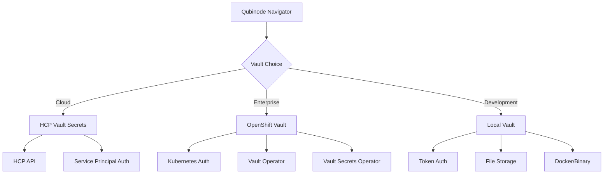

# HashiCorp Vault Options Comparison for Qubinode Navigator

This document provides a comprehensive comparison of all three HashiCorp Vault integration options available for Qubinode Navigator.

## 🏗️ **Architecture Overview**



## 📊 **Detailed Comparison Matrix**

| Feature | HCP Vault Secrets | OpenShift Vault | Local Vault |
|---------|------------------|-----------------|-------------|
| **🚀 Setup Time** | 15 minutes | 45 minutes | 30 minutes |
| **💰 Cost** | $0.03/secret/month | Infrastructure cost | Free |
| **🔒 Security** | Enterprise SLA | Enterprise-grade | Self-managed |
| **📈 Scalability** | Auto-scaling | Kubernetes scaling | Manual scaling |
| **🛠️ Maintenance** | Zero | Kubernetes managed | Full self-service |
| **🌐 Availability** | 99.9% SLA | Cluster dependent | Self-managed |
| **🔐 Auth Methods** | Service Principal | Kubernetes, Token, OIDC | Token, LDAP, AWS, etc. |
| **📦 Deployment** | SaaS | Operator/Helm | Docker/Binary |
| **🔄 Backup** | Automatic | Manual/Automated | Manual |
| **📊 Monitoring** | Built-in | Prometheus/Grafana | Self-configured |
| **🌍 Multi-Region** | Global | Single cluster | Single instance |
| **🔗 Integration** | REST API | Native K8s | Direct API |

## 🎯 **Use Case Recommendations**

### **Choose HCP Vault Secrets When:**
- ✅ You want **minimal operational overhead**
- ✅ You have **budget for managed services**
- ✅ You need **quick time-to-market**
- ✅ You want **HashiCorp support and SLA**
- ✅ You're building **cloud-native applications**
- ✅ You need **global availability**

**Best For:** Startups, cloud-first organizations, teams without dedicated ops

### **Choose OpenShift Vault When:**
- ✅ You're running **enterprise Kubernetes/OpenShift**
- ✅ You need **on-premises or hybrid deployment**
- ✅ You have **strict compliance requirements**
- ✅ You want **native Kubernetes integration**
- ✅ You have **Kubernetes expertise in-house**
- ✅ You need **custom authentication methods**

**Best For:** Enterprises, regulated industries, Kubernetes-native environments

### **Choose Local Vault When:**
- ✅ You're in **development/testing phase**
- ✅ You have **budget constraints**
- ✅ You need **full control and customization**
- ✅ You're **learning HashiCorp Vault**
- ✅ You have **air-gapped environments**
- ✅ You want **maximum flexibility**

**Best For:** Development teams, learning environments, air-gapped deployments

## 🔧 **Implementation Complexity**

### **HCP Vault Secrets (Easiest)**
```bash
# 1. Create HCP account and service principal
# 2. Configure environment variables
export HCP_CLIENT_ID="your-client-id"
export HCP_CLIENT_SECRET="your-client-secret"
export USE_HASHICORP_CLOUD="true"

# 3. Store secrets in HCP UI
# 4. Test integration
python3 enhanced-load-variables.py --generate-config
```

### **OpenShift Vault (Medium)**
```bash
# 1. Deploy Vault Operator
oc apply -f vault-operator-subscription.yaml

# 2. Create Vault instance
oc apply -f vault-instance.yaml

# 3. Configure Kubernetes auth
vault auth enable kubernetes
vault write auth/kubernetes/config ...

# 4. Configure environment
export OPENSHIFT_VAULT="true"
export VAULT_AUTH_METHOD="kubernetes"

# 5. Test integration
python3 enhanced-load-variables.py --generate-config --template openshift.yml.j2
```

### **Local Vault (Medium)**
```bash
# 1. Install Vault (Podman recommended for RHEL 9)
podman run -d --name vault-dev -p 8200:8200 \
  -v ~/vault-data:/vault/data:Z docker.io/hashicorp/vault:latest

# 2. Initialize and unseal
vault operator init
vault operator unseal

# 3. Configure secrets engine
vault secrets enable -version=2 kv

# 4. Store secrets
vault kv put kv/ansiblesafe/localhost rhsm_username="user"

# 5. Test integration
python3 enhanced-load-variables.py --generate-config
```

## 🔐 **Security Comparison**

### **Authentication Methods**

| Method | HCP | OpenShift | Local |
|--------|-----|-----------|-------|
| **Service Principal** | ✅ Primary | ❌ | ❌ |
| **Kubernetes Auth** | ❌ | ✅ Primary | ✅ Available |
| **Token Auth** | ❌ | ✅ Available | ✅ Primary |
| **OIDC/JWT** | ❌ | ✅ Available | ✅ Available |
| **AWS IAM** | ❌ | ✅ Available | ✅ Available |
| **LDAP** | ❌ | ✅ Available | ✅ Available |

### **Security Features**

| Feature | HCP | OpenShift | Local |
|---------|-----|-----------|-------|
| **Encryption at Rest** | ✅ Managed | ✅ Configurable | ✅ Configurable |
| **Encryption in Transit** | ✅ TLS | ✅ TLS | ✅ Configurable |
| **Audit Logging** | ✅ Built-in | ✅ Configurable | ✅ Configurable |
| **Secret Rotation** | ✅ Automatic | ✅ Manual/Automated | ✅ Manual |
| **Access Policies** | ✅ IAM-based | ✅ RBAC + Policies | ✅ Policies |
| **Network Isolation** | ✅ VPC/Private | ✅ Network Policies | ✅ Configurable |

## 📈 **Operational Comparison**

### **Monitoring & Observability**

| Aspect | HCP | OpenShift | Local |
|--------|-----|-----------|-------|
| **Metrics** | Built-in dashboard | Prometheus integration | Manual setup |
| **Logging** | Centralized | OpenShift logging | Manual setup |
| **Alerting** | Built-in | AlertManager | Manual setup |
| **Health Checks** | Automatic | Kubernetes probes | Manual setup |

### **Backup & Recovery**

| Aspect | HCP | OpenShift | Local |
|--------|-----|-----------|-------|
| **Backup** | Automatic | Manual/CronJob | Manual |
| **Recovery** | Point-in-time | Snapshot restore | Snapshot restore |
| **Cross-Region** | Built-in | Manual setup | Manual setup |
| **Testing** | Managed | Manual | Manual |

## 🚀 **Migration Paths**

### **HCP → OpenShift**
```bash
# 1. Export secrets from HCP
curl -H "Authorization: Bearer $HCP_TOKEN" \
  "$HCP_API_URL/secrets" > hcp-secrets.json

# 2. Deploy OpenShift Vault
# 3. Import secrets to OpenShift Vault
# 4. Update configuration
export OPENSHIFT_VAULT="true"
```

### **Local → OpenShift**
```bash
# 1. Export from local vault
vault kv get -format=json kv/ansiblesafe/localhost > local-secrets.json

# 2. Deploy OpenShift Vault
# 3. Import secrets
# 4. Update authentication method
```

### **OpenShift → HCP**
```bash
# 1. Export from OpenShift Vault
vault kv get -format=json kv/ansiblesafe/localhost > openshift-secrets.json

# 2. Create HCP application
# 3. Import secrets via HCP API
# 4. Update configuration
export USE_HASHICORP_CLOUD="true"
```

## 🎯 **Decision Framework**

### **Step 1: Assess Your Environment**
- [ ] Do you have OpenShift/Kubernetes in production?
- [ ] What's your budget for managed services?
- [ ] Do you have dedicated operations team?
- [ ] What are your compliance requirements?
- [ ] How quickly do you need to deploy?

### **Step 2: Choose Based on Priorities**

**Priority: Speed & Simplicity** → **HCP Vault Secrets**
**Priority: Enterprise Integration** → **OpenShift Vault**  
**Priority: Cost & Control** → **Local Vault**

### **Step 3: Implementation Path**

1. **Start with your chosen option**
2. **Test with Qubinode Navigator integration**
3. **Validate security and compliance requirements**
4. **Plan migration path if needed**
5. **Implement monitoring and backup procedures**

## 📋 **Quick Start Commands**

### **HCP Setup**
```bash
# Follow HCP guide
cat docs/vault-setup/HCP-VAULT-SETUP.md
./setup-vault-integration.sh
```

### **OpenShift Setup**
```bash
# Follow OpenShift guide
cat docs/vault-setup/OPENSHIFT-VAULT-SETUP.md
oc new-project vault-system
```

### **Local Setup**
```bash
# Follow Local guide
cat docs/vault-setup/LOCAL-VAULT-SETUP.md
docker run -d --name vault-dev -p 8200:8200 hashicorp/vault:latest
```

## 🎉 **Conclusion**

All three options are **fully supported** by the enhanced Qubinode Navigator system. Choose based on your:

- **Operational maturity**
- **Budget constraints**  
- **Security requirements**
- **Infrastructure preferences**
- **Team expertise**

The beauty of our implementation is that you can **start with one option and migrate to another** as your needs evolve!

**Recommendation for your case:** Since you have HCP access, start with **HCP Vault Secrets** for immediate productivity, then consider **OpenShift Vault** for production enterprise deployment.
